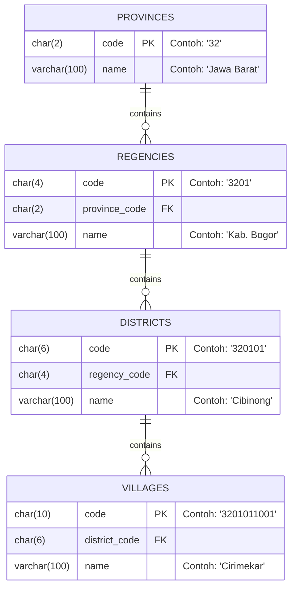

# Valtera Indonesia Regions

Dataset wilayah administrasi Indonesia (Provinsi, Kabupaten/Kota, Kecamatan, Kelurahan/Desa) yang telah disanitasi, dinormalisasi, dan dioptimasi untuk konsumsi publik.

Tersedia langsung dari GitHub dalam bentuk **Static CDN JSON API** (hemat bandwidth untuk cascading dropdown frontend), **Relational CSV**, dan **SQL Dumps** siap import.

[](https://github.com/danikz/valtera-indonesia-regions/actions/workflows/ci.yml)
[](LICENSE)
[](https://www.jsdelivr.com/package/gh/danikz/valtera-indonesia-regions)
[](scripts/validate.py)
[](dist/csv/villages.csv)
[](dist/)
[](https://github.com/danikz/valtera-indonesia-regions/stargazers)
[](https://github.com/danikz/valtera-indonesia-regions/commits/main)

---

## Ringkasan Data

| Entitas | Jumlah | Format Kode | Contoh Kode | Contoh Nama |
| :--- | :---: | :---: | :---: | :--- |
| **Provinsi** | 37 | 2 digit | `32` | Jawa Barat |
| **Kabupaten / Kota** | 514 | 4 digit | `3201` | Kab. Bogor |
| **Kecamatan** | 7.272 | 6 digit | `320101` | Cibinong |
| **Kelurahan / Desa** | 83.763 | 10 digit | `3201011001` | Cirimekar |

> **Catatan Data**: Dataset ini merupakan data resmi Valtera yang telah disanitasi dari anomali format quote SQL (`''`) dan spasi ganda, serta dinormalisasi ke struktur relasional berindeks.

---

## 1. Penggunaan via CDN Gratis (Frontend / Mobile)

Dataset ini dapat langsung di-fetch melalui CDN gratis (jsDelivr) tanpa perlu server backend. Karena jsDelivr melayani file statis, request harus mengarah ke file `.json` langsung (bukan ke folder induk `/dist/api`).

### Daftar Endpoint Lengkap

| Data | URL Endpoint CDN | Ukuran |
| :--- | :--- | :---: |
| **Provinsi** | `https://cdn.jsdelivr.net/gh/danikz/valtera-indonesia-regions@latest/dist/api/provinces.json` | ~2.1 KB |
| **Kab/Kota** | `https://cdn.jsdelivr.net/gh/danikz/valtera-indonesia-regions@latest/dist/api/regencies/{kode_provinsi}.json`<br>*(Contoh Jawa Barat: `.../regencies/32.json`)* | ~1.5 KB |
| **Kecamatan** | `https://cdn.jsdelivr.net/gh/danikz/valtera-indonesia-regions@latest/dist/api/districts/{kode_kabko}.json`<br>*(Contoh Kab. Bogor: `.../districts/3201.json`)* | ~2.5 KB |
| **Kelurahan/Desa** | `https://cdn.jsdelivr.net/gh/danikz/valtera-indonesia-regions@latest/dist/api/villages/{kode_kecamatan}.json`<br>*(Contoh Cibinong: `.../villages/320101.json`)* | ~2.0 KB |

### Contoh Pemakaian (JavaScript / Fetch)

```javascript
const BASE_URL = 'https://cdn.jsdelivr.net/gh/danikz/valtera-indonesia-regions@latest/dist/api';

// 1. Ambil daftar provinsi
const provinces = await fetch(`${BASE_URL}/provinces.json`).then(r => r.json());

// 2. Ambil kab/kota setelah provinsi dipilih (contoh: Jawa Barat = 32)
const regencies = await fetch(`${BASE_URL}/regencies/32.json`).then(r => r.json());

// 3. Ambil kecamatan setelah kab/kota dipilih (contoh: Kab. Bogor = 3201)
const districts = await fetch(`${BASE_URL}/districts/3201.json`).then(r => r.json());

// 4. Ambil desa/kelurahan (contoh: Cibinong = 320101)
const villages = await fetch(`${BASE_URL}/villages/320101.json`).then(r => r.json());
```

---

## 2. Database Dumps (SQL)

Dumps SQL telah dioptimasi dengan batch insert (500 baris per query) serta foreign key dan indeks relasional.

File tersedia di folder [`dist/sql/`](dist/sql):
- **MySQL**: [`dist/sql/mysql.sql`](dist/sql/mysql.sql)
- **PostgreSQL**: [`dist/sql/postgresql.sql`](dist/sql/postgresql.sql)
- **SQLite**: [`dist/sql/sqlite.sql`](dist/sql/sqlite.sql)

### Cara Import

```bash
# MySQL
mysql -u username -p database_name < dist/sql/mysql.sql

# PostgreSQL
psql -U username -d database_name -f dist/sql/postgresql.sql

# SQLite
sqlite3 regions.db < dist/sql/sqlite.sql
```

---

## 3. File CSV Ternormalisasi

Jika membutuhkan format CSV tabel terpisah per entitas untuk database seeder (Laravel, Django, Prisma, Go) atau analisis data:

- [`dist/csv/provinces.csv`](dist/csv/provinces.csv) (`code`, `name`)
- [`dist/csv/regencies.csv`](dist/csv/regencies.csv) (`code`, `province_code`, `name`)
- [`dist/csv/districts.csv`](dist/csv/districts.csv) (`code`, `regency_code`, `name`)
- [`dist/csv/villages.csv`](dist/csv/villages.csv) (`code`, `district_code`, `name`)

Tersedia juga file kompresi tunggal seluruh data untuk kebutuhan offline:
- [`dist/indonesia-regions.min.json`](dist/indonesia-regions.min.json) (~6 MB)

---

## Struktur Database



---

## Development & Build Pipeline

Jika ingin memperbarui master data di [`data/kode_wilayah.csv`](data/kode_wilayah.csv) dan membangun ulang seluruh artefak:

```bash
# Menjalankan build generator (JSON CDN, CSV, SQL, Monolith)
python scripts/build.py

# Menjalankan validasi integritas relasi & format data
python scripts/validate.py
```

---

## Lisensi

Dilisensikan di bawah [MIT License](LICENSE). Bebas digunakan untuk proyek komersial maupun non-komersial.
